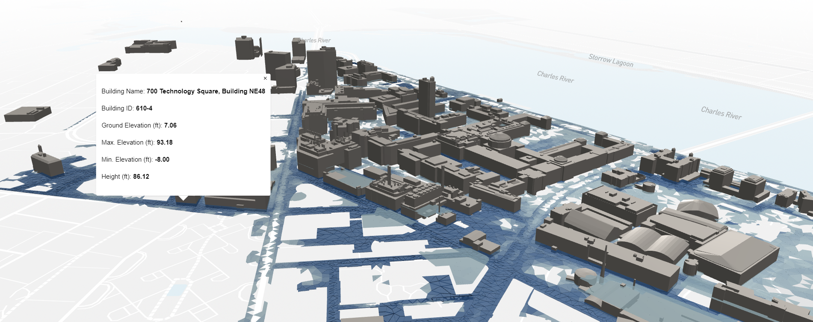

# Communicating Flood Risk through Interactive Data Visualization

### MIT Summer Research Program Case Study with MIT's Urban Risk Lab
### By Carolina Pérez Méndez
### Supervised under Mayank Ojha and Miho Mazereeuw


<!-- # **Table of Contents**

1. [Abstract](#abstract)
2. [Introduction](#introduction)
   
   2.1 [Objectives](###2.1-objectives-of-the-study)<br>
   
   2.2 [Purpose](#2.2-purpose)<br>
   
   2.3 [Hypothesis](#hypothesis)<br>
   
   2.4 [Scope](#scope)<br>
   
   2.5 [Prerequisites](#prerequisites)<br>
   
3. [Methodology](#methodology)
   
   3.1 [Strategizing and Researching Past Projects](#strategizing-and-literature-review)<br>
   
   3.2 [Starting with Mapbox Studio Style](#starting-with-mapbox-studio-style)<br>
   
   3.3 [Setting Up the Code](#setting-up-the-code)<br>
   
   3.4 [Uploading my own model into Mapbox](#uploading-my-own-model-into-mapbox)<br>
   
   3.5 [Attaching the Metadata to the glTF](#attaching-the-metadata-to-the-gltf)<br>

   3.6 [Adding more Models, Scaling and Positioning](#adding-more-models,-scaling-and-positioning)<br>
   
   3.7 [Style, lights, and popups](#style-lights-and-popups)<br>
   
4. [Results](#results)
5. [Discussion](#discussion)
6. [Conclusion](#conclusion)
   
   6.1 [General Conclusion](#general-conclusion)
  
   6.2 [Research Poster](#research-poster)
   
7. [Appendix](#appendix)
8. [Acknowledgments](#acknowledgements) -->


# **Table of Contents**

1. [Abstract](#abstract)
2. [Introduction](#introduction)
   1. [Objectives](#21-objectives-of-the-study)
   2. [Purpose](#22-purpose)
   3. [Hypothesis](#23-hypothesis)
   4. [Scope](#24-scope)
   5. [Prerequisites](#25-prerequisites)
3. [Methodology](#methodology)
   1. [Strategizing and Researching Past Projects](#1-strategizing-and-researching-past-projects)
   2. [Starting with Mapbox Studio and Style](#2-starting-with-mapbox-studio-and-style)
   3. [Setting Up the Code](#3-setting-up-the-code)
   4. [Uploading my own model into Mapbox](#4-uploading-my-own-model-into-mapbox)
   5. [Attaching the Metadata to the glTF file](#5-attaching-metadata-to-the-gltf-file)
   6. [Adding more Models, Scaling and Positioning](#6-adding-more-models-scaling-and-positioning)
   7. [Style, lights, and popups](#7-style-lights-and-popups)
4. [Results](#results)
5. [Discussion](#discussion)
6. [Conclusion](#conclusion)
   1. [General Conclusion](#61-general-conclusion)
   2. [MSRP Research Forum Poster](#62-msrp-research-forum-poster)
7. [Appendix](#appendix)
8. [Acknowledgments](#acknowledgements)


# **Abstract**

Effective flood risk communication is crucial for promoting resilience and informed decision-making in flood-prone areas. However, current flood maps and risk communication techniques have inherent limitations that hinder their effectiveness. This research addresses these gaps by developing interactive data visualization strategies to enhance flood risk communication. It aims to improve understanding, engagement, and proactive measures for mitigating flood risks. The focus is on the development of three-dimensional mapping techniques to depict flood hazards in a more realistic and immersive manner. The research leverages Mapbox GL JS, a JavaScript library for developing web maps and applications with Mapbox's advanced mapping technology, to create an interactive three-dimensional flood map of the MIT campus as a living laboratory. This map will enable the sharing of flood risk information with different departments, facilitating adaptation and mitigation projects. The main challenge lies in importing and transforming 2D data into three-dimensional GIS data and employing suitable visualization techniques. The results are expected to enhance the accuracy, visual representation, and accessibility of flood risk data, empowering stakeholders to better understand and respond to flood risks. This research holds significance for architectural data visualization strategies, advancing the field and benefiting the broader community involved in flood risk management.

# **Introduction**

With the rise of interactive data visualization and advancements in technology, vulnerable communities are more equipped with powerful tools to understand and mitigate the risks posed by floods. Flood mapping has emerged as one of the most effective strategies for communicating flood risks, enabling individuals and organizations to grasp the nature, magnitude, and likelihood of hazards in their area. However, current flood maps often fall short of accurately representing the true extent of flood risk due to limitations and sources of uncertainty in data gathering and analysis processes.

In this research report, we delve into the realm of interactive data visualization to enhance flood risk communication. We helped develop a strategy that facilitates understanding, engagement, and informed decision-making among diverse stakeholders, ultimately promoting proactive measures for mitigating flood risks. To achieve this, we focus on the technical aspects and challenges involved in creating an interactive three-dimensional (3D) flood map, specifically within the context of the Massachusetts Institute of Technology (MIT) campus.

In an era marked by increasing climate uncertainties and the growing need for effective flood risk communication, the development of interactive 3D flood maps has emerged as a promising solution. These maps provide stakeholders with a visually immersive and intuitive representation of flood hazards, enabling them to better understand, analyze, and respond to potential risks. By exploring the technical aspects of creating an interactive 3D flood map, we aim to contribute to the field of flood risk communication and promote resilience in the face of flood events.

The MIT campus serves as an ideal case study for this research, offering a diverse range of structures that can be depicted in a 3D environment. By mapping the flood hazards present on the campus, we can enhance flood risk communication and empower stakeholders with valuable information to make informed decisions. Through this research, we aim to uncover the technical considerations and challenges involved in developing an interactive 3D flood map of the MIT campus, paving the way for more effective flood risk communication strategies. By three-dimensionally mapping flood hazards on the campus, we can share vital information with different departments and encourage the implementation of adaptation and mitigation projects.

By addressing the limitations and sources of uncertainty in current flood mapping processes, we can bridge the gap between scientific data and meaningful understanding. Through interactive data visualization, we strive to empower individuals, communities, and decision-makers to proactively respond to flood risks and build a more resilient future. The findings and insights gained from this research have the potential to inform and improve flood risk communication strategies not only on the MIT campus but also in other vulnerable areas around the world. The knowledge gained from this process will extend beyond the campus, benefiting residential areas, commercial zones, and cities collaborating with communities on urban adaptation and mitigation initiatives.

This report will include a step-by-step guide to how this map came into existence. It will also include the specific technical challenges that we encountered in its development, such as importing 3D data into Mapbox, a mapping platform, and transforming typical 2D data into 3D GIS data. And it will demonstrate how to employ suitable visualization techniques in flood maps, and how we designed our intuitive interface. Our comprehensive documentation encourages other designers and architects to continue experimenting with interactive three-dimensional mapping through web development tools and it shall facilitate the process for first-time users. The results of this research, including this report and findings on how to create map, are meant to help grow and improve data representation into the comprehensive "MIT Climate Resilience" dashboard being developed by the Urban Risk Lab within the framework of their Climate Grand Challenge, entitled "Preparing for a New World of Weather and Climate Extremes", which is an initiative aimed to deliver "high-impact climate solutions" and researching "game-changing advances." By executing this, we can reach a wide range of users and ensure wider accessibility and dissemination of flood risk information. Our research seeks to enhance the accuracy, visual representation, and accessibility of flood risk data.

In conclusion, this research report explores the technical aspects and challenges involved in creating an interactive 3D flood map, focusing on the specific case of the MIT campus. By leveraging interactive data visualization techniques, we aim to enhance flood risk communication, promote understanding and engagement among stakeholders, and ultimately contribute to the development of proactive measures for mitigating flood risks. With the ever-increasing climate uncertainties, the development of effective flood risk communication strategies is paramount for building resilient communities and safeguarding lives and assets.

### **2.1 Objectives of the study**


Figure 1: Objectives Diagram

### **2.2 Purpose**

The research that will be conducted during the summer holds significant importance as it not only expands on architectural data visualization strategies for communicating flood risk but also contributes to advancing the field. It can enhance both the quality of representation and analysis and lower the knowledge barriers that impede non-expert audiences' understanding of flood hazards in risk communication. ("3D Geovisualization Interfaces as Flood Risk Management Platforms: Capability, Potential, and Implications for Practice," 2020) The findings and insights gained from this research can potentially inform future practices in architectural data visualization, benefiting both the field itself and the broader community involved in flood risk management and decision-making.

### **2.3 Hypothesis**

The hypothesis of this research is that creating interactive data visualizations tailored to the needs of various stakeholders will facilitate their active involvement in the decision-making process regarding flood risk mitigation. By providing user-friendly interfaces, intuitive controls, and customizable features, these interactive visualizations will enhance understanding, engagement, and informed decision-making among diverse audiences. The hypothesis suggests that such interactive data visualizations can effectively communicate complex flood risk information, foster stakeholder engagement, and ultimately promote proactive measures for mitigating flood risks at the community and individual levels.

### **2.4 Scope**

This research is part of the MIT Summer Research Program, an immersive 9-week program for international and national students with an interest in executing cutting-edge research with renowned professors at one of the best institutions in the world. This summer I worked with the Urban Risk Lab during the duration of this program.

### **2.5 Prerequisites**

In this section, we will identify and define all programs, platforms, websites, and tools used to develop the map.

**A. For Mapping**

A.1 Mapbox: is a platform focused on location data, catering to the need for personalized online maps on websites and applications. It presents a wide array of map styles, data sources, and developer tools, empowering designers and developers to craft engaging and ever-changing maps.

A.1.1 Studio: is a web-based design tool offered by Mapbox that allows users to create, customize, and design their own maps. It is a powerful map design studio that enables developers and designers to control every aspect of their maps, from choosing the color schemes and typography to defining the layout and interaction behaviors.

A.1.2 Style: refers to a JSON-based specification used to define the visual appearance and behavior of maps created with Mapbox. Its main components are Layers, Sources, Symbology, and Interactivity.

A.1.3 Examples: these are a set of maps or other details created by users using the platform. Mapbox provides them as a tool to help guide new users.

A.2 Qgis: It is a powerful platform that provides extensive functionalities for spatial data analysis, mapping, and visualization while emphasizing its commitment to openness and accessibility to all users without any licensing fees.

**B. For Coding**

B.1 Visual Studio Code (VS code): Visual Studio Code is a revolutionary code editor that has been redesigned and fine-tuned to cater specifically to the needs of developers working on contemporary web and cloud applications. This cutting-edge editor offers a seamless and efficient environment for writing, editing, and debugging code, empowering developers to tackle the complexities of modern software development with ease.

B.2 Mapbox GL JS: is a JavaScript library that allows you to create interactive and configurable vector maps on the Web. It renders map data from Mapbox Vector Tiles, using the Mapbox Style specification and hardware-accelerated graphics (WebGL).

B.2.1 Access token: is a unique identifier that grants access to Mapbox services and APIs. It acts as a security key, allowing developers to authenticate their requests and use Mapbox's location data platform in their applications. When you sign up for a Mapbox account, you can obtain an Access Token from the Mapbox website or dashboard. This Access Token must be included in the requests you make to Mapbox

B.3 Node Package Manager (npm): is the package manager for [Node.js](http://nodejs.org/). Designed to help JavaScript developers easily share packaged modules of code.

B.4 Github: is a cloud-based platform designed for software development and version control using Git. It offers developers a centralized space to store and efficiently manage their code.

B.3.1 Repository: is a central location where developers can store, manage, and collaborate on code and project files using Git. It generally contains all project files and it's revision history.

B.5 Threejs: is a JavaScript 3D Library that provides a set of tools and functionalities that make it easier for developers to work with WebGL, a low-level web-based graphics API, which allows for hardware-accelerated 3D rendering within modern browsers.

B.6 Live Server Plugin: is a VS code extension that allows us to start a development local server with live reload feature, catering to both static and dynamic pages.

B.7 Qgis2threejs Plugin: is a Qgis plugin that helps visualize vector data in 3d on a web view. It reads 3d shapefiles and allows the extrusion of 2d shapefiles. By leveraging this tool, we can export glTF objects and an HTML file of the map.

**C. Websites for acquiring resources:**

C.1 Bboxfinder: is a C# library typically used in mapping applications. Helps find max web mercator bbox for all coordinate systems supported by proj4.

C.2 Chatgpt: a language model supported by AI to generate responses to questions. It is a useful tool to learn tips and tricks for programming for first-time users.

C.3 Youtube: a popular video-sharing website useful for searching tutorials.

C.4 glTF editor: is an online editor that allows us to edit, visualize, scale, and save glTF files. Most importantly it allows us to control individually each node of the model. In addition to this it allows us to save a glTF file in other formats, for example STL.

C.5 Threejs editor: is a web-based visual editor designed to work with the Three.js library.

C.6 City of Cambridge GIS portal: a portal developed by the City of Cambridge that provides interactive mapping applications, static maps, and most importantly GIS data download.

**D. Three-dimensional software**

D.1 Blender: is a powerful and open-source 3D computer graphics software used for creating animated films, visual effects, art, 3D models, and interactive 3D applications.

D.2 Rhino (optional): a software program used for drafting and 3d modeling. It is mostly used because of its effective interface allowing users to draw from different views at once. It is mainly used for creating organic and complex shapes.

D.3 Sketchup (optional): a "3d modeling Computer-Aided Design (CAD) program" used for design applications.

**E. Layer file formats**

E.1 glTF: is a freely available standard used for transmitting and loading 3D scenes and models in applications. It aims to optimize the efficiency of transmitting 3D assets by reducing their size and minimizing the processing required to unpack and utilize them.


<p align="center"><em> Figure 2: Overview of glTF by Khronos</em>.<p>

E.2 GeoJson: is a geospatial data interchange format that showcases geographic features and their attributes.

E.3 Shapefiles: is a digital vector data file format used for geographic information system software.

E.4 OBJ: is a 3d standard format. It has the ability to recognixe 3d objects' surface properties, including texture mapping and shading, making it efficient for developing realistic render of a model.

# **Methodology**

### **1. Strategizing and Researching Past Projects**

Getting started by identifying creative innovative ways to communicate flood risk. By brainstorming an effective way to execute this mission, we agreed that the best experimental approach for this summer's case study was developing a three-dimensional map of the MIT campus, which allows us to study flood problems in depth. It gives us the opportunity to experiment with Mapbox mapping capabilities, the cloud mapping platform used to employ the task.


At the beginning, a project done by Smart City Cologne was used as an example for understanding risk assessment through 3d mapping.


<p align="center"> <em>Figure 3: Smart City Cologne Flood Plan.

Article: Planning the City of Tomorrow in 3D, written by Jim Baumann
[(https://www.esri.com/about/newsroom/arcuser/planning-the-city-of-tomorrow-in-3d/)](https://www.esri.com/about/newsroom/arcuser/planning-the-city-of-tomorrow-in-3d/)</em>. <p>

Morgenstadt: City of the Future is an initiative by Fraunhofer Society in 2010 “to develop and implement technologies for future cities that are climate-adapted, carbon dioxide neutral, and energy efficient.” (Baumann, 2019) They “used GIS technologies combined with geodesign planning methodology to support the implementation of a holistic approach to sustainable urban development” (Baumann, 2019). They developed a 3d interactive model with ArcGIS City Engine to plan a new sustainable city in Cologne, a city in Germany on the Rhine River, responding to flood threats in the area. 

 Developing an interactive 3D model with CityEngine for the revitalization of Mülheim Süd involved integrating various datasets and using advanced GIS technologies to create a comprehensive and detailed representation of the project area. The process was carefully planned and executed to account for different environmental factors, including flooding, noise levels, and energy consumption

 Considering that Cologne is situated along a major European river, flooding was a critical concern. CityEngine was employed to model existing flood data, which provided visualizations of flood inundation levels in Mülheim Süd. By rasterizing and vectorizing water level data and the DTM, potential flooding scenarios and their impact on streets and buildings could be displayed effectively.

 The methodology highlighted the cost-effectiveness and efficiency of 3D GIS technology for sustainable urban development. The workflow and tools developed for this project were adaptable for other communities.


In our pursuit to enhance flood data visualizations, we have undertaken an approach that seeks to revolutionize flood mapping and address previous limitations. Our research diverges from conventional efforts in two fundamental aspects, symbolizing our commitment to advancing flood risk management.

First, our primary focus revolves around the comprehensive development of flood maps for the existing conditions at MIT. By meticulously studying and understanding the intricate flood risk scenarios within the MIT campus area, we aim to create accurate and informative flood data visualizations. This profound understanding empowers us to identify vulnerable areas and potential mitigation strategies, laying the groundwork for a more resilient and prepared community.

Secondly, we have embarked on executing the flood mapping process through a cutting-edge WebGL-powered mapping platform. This innovative platform introduces a host of unparalleled advantages, notably rendering high-performing maps that deliver lightweight and fast-running outcomes. By embracing this advanced technology, we transcend the limitations of conventional mapping approaches, enabling seamless access and usability of the flood maps for all users.

Through these transformative changes, we are poised to revolutionize flood data visualizations, optimizing their effectiveness and applicability in decision-making processes. By harnessing the power of innovative technology, we envision a future where flood risk management is elevated to new heights, fostering a safer, more resilient, and sustainable environment at MIT and beyond. As we continue to push the boundaries of flood data visualizations, our endeavor remains steadfast in making meaningful contributions to the field of urban resilience and disaster preparedness.

### **2. Starting with Mapbox Studio and Style**

Choosing Mapbox as our main platform was crucial because it is well-suited to create interactive 3d maps. Mapbox enables us to visualize the MIT campus in three dimensions, which is essential for accurately depicting elevation changes and simulating the impact of flooding. Most importantly it gives us the flexibility and versatility to edit the map directly in Mapbox Studio by importing, filtering, and styling layers from shapefiles and geojson. Simultaneously, it enables us to use Mapbox GL js to edit the map and add additional data to the map through code. And it also, allows the map to be published in the GitHub repository and it is compatible with the series of maps contained in the MIT Climate Resilience dashboard.

First we start by opening Mapbox, creating an account with MIT institutional email and an access token, which Mapbox uses to associate your account with your requests to Mapbox API resources. Then we move to opening and editing a style in Mapbox Studio. For this particular map, I chose "Mapbox Light."

`Style URL:`  mapbox://styles/mapbox/light-v11

This style is useful for highlighting colored-data layers. Once the style has uploaded, we have editing capabilities to edit the style as one desires. And most importantly, we can start importing layers.

As provided by the Urban Risk Lab, the first two layers to be added were: 

* <em>"MIT Building.geojson"</em> 

The MIT Building layer contains the silhouette of all MIT buildings on campus.

* <em>"2070\_100y\_Storm\_24h.geojson"</em> 

The Flood Hazard layer contains the highest water level during a flood caused by a hypothetical 11.7-inch rainfall over 24 hours on campus, considering altered climatic conditions, is referred to as the peak flood elevation. This event has a 10% chance of occurring every year. However, over a span of 50 years, there's a 39% likelihood of experiencing this particular event. The parameters for this simulated storm are founded on projected climate alterations anticipated for the year 2070.

These 2D layers will be used as references for placing the 3D models.  

After importing the layers, in the Mapbox Studio style editor, turn on 3d buildings by clicking on the buildings component to open the component properties panel and click the 3d building toggle to "on". This step is important because it allows us to explore map three-dimensionally. You can also "toggle on" the 3D terrain to demonstate different terrain elevation in three-dimensions. 


> **Note:** This URL provides more information about the documentation of the plugin: [Three.js – JavaScript 3D Library (threejs.org)](https://threejs.org/)
>
> This URL provides the full code and an introduction to [Add a 3D model | Mapbox GL JS | Mapbox](https://docs.mapbox.com/mapbox-gl-js/example/add-3d-model/)


 Keep in mind that in order to highlight the buildings presented in the MIT Building layer, the mapbox's building layer was turned off.


After editing, it is crucial to publish the style to preserve changes in future steps.

### **3. Setting up the Code**

For this step we first start by downloading Visual Studio Code (vs code). Start by creating a file and opening it in vs code. Create a basic "index.html" inside the file.

Go back to Mapbox in the browser and install Mapbox GL JS to create a web map with Mapbox GL JS. There are two methods to install it by using the Mapbox CDN or a module bundler, as recommended by Mapbox the node package manage (npm). After installing the npm package, include the GL JS CSS file by pasting this on the \<HEAD\>of the html file created previously.

```Code Block 1: HTML code snippet including stylesheet to  Mapbox GL JS library version 2.8.1.```
```javascript

\<link href='https://api.mapbox.com/mapbox-gl-js/v2.8.1/mapbox-gl.css' rel='stylesheet' /\>

```

And, by adding the map class to your site by pasting this code under "\<BODY\>" :

```Code Block 2: HTML code snippet initializing Mapbox map ```

```javascript

mapboxgl.accessToken = '\<your access token here\>';

const map = new mapboxgl.Map({

container: 'map', // container ID

style: 'mapbox://styles/mapbox/streets-v12', // style URL

center: [-74.5, 40], // starting position [lng, lat]

zoom: 9 // starting zoom

});
```

Now, we are set to use Mapbox GL JS by accessing it through VS Code.

First, we can start by inserting our Mapbox individual user access token to track our progress.

 Then, we can start setting a map style and an initial view. For changing the style, we can use the style URL from our published Mapbox style and copy-paste it after "style:" between the apostrophes. 
 
 By downloading a VS code plugin called "Live Server", we can use it to open a window to view the index.html. Right-click anywhere on the HML file and click on "Open with Live server" a window shall appear with the Mapbox style. Every time a change is made in Mapbox Studio style, it shall be published in order to view the updated version of the style in the HTML file. 
 
 To set an initial view, we can use "bboxfinder" to find the latitude and longitude of a specific location and replace it where it says "center "on the map class code.

The next step is loading a basic web map using a Mapbox example. And luckily, there is a code already written for adding 3d models into Mapbox using Three.js. You can do this by copy & pasting the entire code into the index.html file.


> **Note:** This code already includes the Mapbox GL JS setup, which means it is not necesary to copy the entire code if you already did the previous part. 

>   
> **Note:** This URL provides more information about the documentation of the plugin: [Three.js – JavaScript 3D Library (threejs.org)](https://threejs.org/)
> 
> This URL provides the full code and an introduction to [Add a 3D model | Mapbox GL JS | Mapbox](https://docs.mapbox.com/mapbox-gl-js/example/add-3d-model/)
> 


The code provided by Mapbox is used to import a Satellite as GLTF file in a Mapbox Style. 

`Code Block 3: Add a 3d model using threejs (Mapbox Example)`

```javascript
\<!DOCTYPE html\>

\<html\>

\<head\>

\<meta charset="utf-8"\>

\<title\>Add a 3D model\</title\>

\<meta name="viewport" content="initial-scale=1,maximum-scale=1,user-scalable=no"\>

\<link href="https://api.mapbox.com/mapbox-gl-js/v2.15.0/mapbox-gl.css" rel="stylesheet"\>

\<script src="https://api.mapbox.com/mapbox-gl-js/v2.15.0/mapbox-gl.js"\>\</script\>

\<style\>

//... 

```
> **Important:** Please view full code in Appendix before continuing with the next steps.

Lets break down this code.  

1. **HTML Document Setup:**
   
   The code starts with the basic structure of an HTML document. It declares the document type, includes meta information, and links to external libraries and stylesheets.

2. **Meta and Stylesheet Links:**

   - `<meta charset="utf-8">`: This meta tag sets the character encoding of the document to UTF-8, which is a widely used character encoding for displaying various languages.
   
   - `<title>`: Sets the title of the HTML document, which is typically displayed in the browser's title bar or tab.
   
   - `<meta name="viewport" content="initial-scale=1,maximum-scale=1,user-scalable=no">`: This meta tag defines the viewport settings for mobile devices, ensuring that the initial scale is set to 1 and users can't zoom the content.
   
   - `<link href="https://api.mapbox.com/mapbox-gl-js/v2.15.0/mapbox-gl.css" rel="stylesheet">`: This `<link>` tag references the CSS stylesheet for Mapbox GL JS, which is used to style the map components.

   - `<style>`: This section contains inline CSS styles for the HTML document. In this case, it sets some basic styles for the body and the map container.

3. **JavaScript Libraries:**

   - `<script src="https://api.mapbox.com/mapbox-gl-js/v2.15.0/mapbox-gl.js"></script>`: This `<script>` tag links to the Mapbox GL JS JavaScript library, which provides the tools for creating interactive maps.
   
   - `<script src="https://unpkg.com/three@0.126.0/build/three.min.js"></script>`: This `<script>` tag links to the Three.js library, which is used for creating and manipulating 3D graphics in the browser.
   
   - `<script src="https://unpkg.com/three@0.126.0/examples/js/loaders/GLTFLoader.js"></script>`: This `<script>` tag links to the GLTFLoader module of Three.js, which is responsible for loading 3D models in GLTF format.

4. **Map Container:**

   - `<div id="map"></div>`: This `<div>` element with the ID "map" is where the Mapbox map will be displayed. It serves as the container for the map.

5. **JavaScript Code:**

   - `mapboxgl.accessToken`: This line sets the access token for Mapbox, which is required for using Mapbox services and APIs. The access token is specific to your Mapbox account.

   - `const map = new mapboxgl.Map({ ... })`: This initializes a Mapbox map object with various configuration options. These options include the container ID, style URL, initial zoom level, center coordinates, pitch (tilt angle), and antialiasing settings.

   - **3D Model Parameters:** These lines define parameters for the 3D model's position, altitude, rotation, and transformation. They ensure that the 3D model is correctly positioned and aligned with the map's geospatial coordinates.

   - `const THREE = window.THREE;`: This line assigns the Three.js library to the variable `THREE`, allowing you to use Three.js functions and classes.

   - `const customLayer = { ... }`: This object defines a custom layer using Three.js for rendering the 3D model on the map. It includes methods like `onAdd` and `render` that handle adding the layer to the map and rendering the 3D model.

6. **`map.on('style.load', () => { ... });`**:

   This code attaches an event listener to the map's 'style.load' event, which triggers when the map style has finished loading. Inside this listener, the custom 3D model layer (`customLayer`) is added to the map. The layer is positioned to render on top of the 'waterway-label' layer.


Once you save the index.html file on VS code, the map and the 3D object (the satellite) must be visible when the live server is open. After going live, you will notice that it is wrongfully placed in another part of the world map. You can use "bboxfinder once again to place the satellite accordingly, by changing the latitude and longitude in "const modelorigin: ()" under the "Parameters to ensure the model is georeferenced correctly on the map".

### **4. Uploading my own model into Mapbox**

We now know it is possible to load a 3d object into Mapbox. The challenge now is figuring out how to import one of our own models into Mapbox.


We saw before, on the code that our satellite model was a GLTF uploaded through a GLTF loader from Three,js. If we observe the part of the code that adds the GLTF loader, we can view that highlighted link is the source for the 3d object.

`Code Block 4: 3D Object Loader (GLTFLoader)`

```javascript
const loader = new THREE.GLTFLoader();

loader.load(

'https://docs.mapbox.com/mapbox-gl-js/assets/34M\_17/34M\_17.gltf',

(gltf) =\> {

this.scene.add(gltf.scene);

}

);

this.map = map;
```

This means that by changing that URL we are able to to replace it with our own URL containing our own model. We do this by creating a Github account, creating a folder in desktop to store the files and creating repository in Github. The next step is to import a GLTF model into the folder. We can create a GLTF model by exporting through Sketchup or Blender.

Open the folder on VS Code to host the repository on your computer. Next, <em>Ctr+Shift+P</em>, and code <em>\>git clone</em>. Press "enter" to clone your folder on repository. Choose <em>"Clone from Github"</em> and choose the file destination for repository.

After this open a new terminal and enter: 

`Code Block 5: Pushing to the Github repository `

`1. `

 ```
 cd .\repository_name\
 ```

 Press "enter" and on the next line code: 
 
 `2.`
 ```
 git add .
 ``` 
  On the following,

  `3.`
  ```
  git commit -m "Add message" 
  ``` 
 Notice that on the left side of the menu the name of the GLTF file stopped being green.
 
After all this, add the file to the repository by entering:

`4. `

```
git push
```

You can verify that this process was executed correctly by viewing the GLTF file directly on your repository through your Github account. If it appears, this process was done correctly. If not, then trace back your steps to make sure you didn't miss anything.

This process ensured uploading the GLTF file to the repository. Now, we have to trace the file by creating the URL.

> **Its main composition is:**
> 'https://raw.githubusercontent.com/username/repository\_name/branch/title\_of\_file'

An example of the URL is:

'https://raw.githubusercontent.com/example-user/3d-models/main/Building10.gltf'

Once the model is uploaded, open it in blender find the model origin and use "bboxfinder" to recenter the model.

### **5. Attaching Metadata to the GLTF file**

  

  Having established a method for uploading our custom model, our next step involves downloading and editing a Cambridge building shapefile.

  Start by visiting the City Cambridge GIS portal and downloading their new, sophisticated 3D GIS Data. In which they have 3D buildings of Cambridge in different formats including: Skechup, ESRI Shapefile, STL, OBJ, and GLTF.

> **Note:**  Follow this URL to find 3D GIS resources of Cambridge: [3D GIS Data - City of Cambridge](https://www.cambridgema.gov/GIS/3D/3ddata)
>
> Follow this URL to download:  [ESRI Shapefile Cambridge Citywide Data](https://www.cambridgema.gov/GIS/3D/3ddata/esrishapefile)

The specific file we are looking for is called <em>"Camb3D_Bldg_Active_MP_SHP.zip"</em>. This file contains all of Cambridge 3D buildings with corresponding metadata. Extract this zip file and open the ESRI Shapefile in Qgis. 

In addition to this step, open the 2D MIT Building layer on top of it. 

Right Click on the <em>"Camb3D_Bldg_Active_MP_SHP"</em> layer and select toggle editing. On Qgis main ribbon, choose <em>"Select Features by Area or Single Click"</em> and start deleting all the buildings that are not part of MIT (the color of the building will change to yellow when selected). We are mainly doing this to the reduce file size, but it is also important to emphasize the MIT buildings in our map. It is important to use the imported 2D MIT Building layer as reference when deleting. 

Once all the unwanted buildings are deleted. Right Click on <em>"Camb3D_Bldg_Active_MP_SHP"</em> and click on  <em>"Save Layer Edits"</em>. 

Great! Now you ready to download Qgis2three.js plugin by first searching on the "Menu tool bar" on Qgis and clicking on "Manage and Install Plugins". Search for "Qgis2three.js" and install the plugin. 

Once the plugin has been installed, make sure the Coordinate Reference System (CRS) is set to "EPSG:3857" and open the plugin. 

>**Note:**  Set the CRS to EPSG:3857. This important because the GLTF model that we will be exporting might get distorted based on the placed CRS.

A window must popup with the plugin displaying a blue sky gradient. On the left side of the window, turn on <em>"Camb3D_Bldg_Active_MP_SHP"</em> by checking the box on the left side of the name. Since the layer already had 3D properties there is no need to extrude the layer, but we must right click on the layer, open the layer properties, and check the box for "Export attributes" in the Attributes section. As of right now, you should be seeing the three-dimensional layer. If not, right click on the layer found in the layer panel and select "Zoom to layer Objects".

Before exporting the scene, we can adjust the scene settings by opening the "scene setting" and changing the "World Coordinates (WC)" and "Base Extent (BE)". For this particular 3D model, we left the WC as "Center of Base Extent" and BE as "Use map canvas extent".

Now, we can finally export the scene as a GLTF by clicking on "file" and "Save scene as GLTF". 

Now that we have our gltf file, we may want to open it on the gltfeditor website online to study the strusture of the GLTF file. We can do this by identifying the children, nodes, and meshes of the object. Every children has a number that corresponds to each building. This is helpful because it allows to make sure that every building has the correct attributes. 

The GLTF file exported from the plugin contained the correct attributes. The problem is that all attributes have been exported as strings. They must be keys and values. 

We fixed this by temporarily using python and coding the following: 

`Code Block 6: Converting Metadata from strings to keys and values`

```python
import json

# Custom serialization function
def custom_serializer(obj):
    if isinstance(obj, (int, float)):
        return obj  # Return the original value
    raise TypeError(f'Type {type(obj)} not serializable')

f = open('test3d/RELOAD-Ed.json')

# returns JSON object as
# a dictionary
data = json.load(f)

names = ["Model_ID", "Building_I", "Name", "POI_Type", "Model_Date", "Model_Sour", 
         "Ground_Ele", "Max_Elev_F", "Min_Elev_F", "Height_Ft", "Center_Lat", "Center_Lon", 
         "Google_Lin",	"Nearmap_Li", "Editor", "Edit_Date", "Edit_Note", "Tile", "Model_Cred", 
         "Status", "created_us", "created_da"]


for item in data['nodes']:
    try:
        properties = item["extras"]["properties"]

        tempdict = {}
        for n in range(len(names)):
            try:
                tempdict[names[n]] = float(properties[n])
            except:
                tempdict[names[n]] = properties[n]

        item["extras"] = tempdict

        with open('test3d/RELOAD-Ed.json', 'w') as file:
            json.dump(data, file, default=custom_serializer)
    except:
        break
```

Lets break down the code, step by step:

1. Fist, we start by importing the json module: `import json`, then we define a custom serialization function (lines 3-7). This function is used to handle the serialization of certain types (specifically, `int` and `float`) during the JSON dumping process.

2. We move on to opening our JSON file containing the 3D object for reading: `f = open('test3d/RELOAD-Ed.json')`. 
Then, we load JSON data from the file into a dictionary: `data = json.load(f)`. The JSON content from the file is loaded into the `data` dictionary.

3. After this step, we define a list of property names: `names = ["Model_ID", "Building_I", ... "created_da"]`. This list contains names corresponding to various properties of each building.

4. Then loop through each item in the 'nodes' section of the JSON data by coding: `for item in data['nodes']:`. This loop iterates through each item in the 'nodes' section of the JSON data.

5. After looping, extract properties from 'extras'by coding:
    `try:
       properties = item["extras"]["properties"]`.
  By doing this, we are accessing the `properties` key within the `extras` section of the current item.

6. After extracting the properties, create a temporary dictionary for property manipulation:
   `tempdict = {}`. This dictionary will hold the modified properties for the current item.

9. Now, loop through property names and populating `tempdict`by adding lines 29-33 of code block 6. This loop iterates through the `names` list, attempting to convert each property's value to a float (if it's numeric). If the conversion fails, it simply assigns the original value to the `tempdict`.

10. Update the 'extras' section of the item by: `item["extras"] = tempdict`. The original `extras` section of the current item is updated with the modified properties stored in `tempdict`.
 Adding on the `extra` section is crucial because it allows us to make the necessary changes to add attributes without altering the code. 

11. Write the modified JSON data back to the file:
`with open('test3d/RELOAD-Ed.json', 'w') as file:
        json.dump(data, file, default=custom_serializer)`

    The modified JSON data is written back to the same file, utilizing the custom serialization function defined earlier.

12. And, finally add the exception handling for handling errors: `exccept: break`. If any exception occurs during the above process, the loop is broken.

After doing this save the main.py and the GLTF file to push them through the Github reposity and load the GLTF into the map. It should appear, but you might notice something off with the model's position and scale. 


### **6. Adding More Models, Scaling, and Positioning**
   
  * **Adding More than one model** 

    * Adding Flood Hazard Layer
    
     Before we start scaling and positioning our model properly. Lets work on loading all of the models we need to develop this map. Now that we have our MIT Buildings model, lets work with our flood hazard layer. 
    
     Similarly, to how we imported <em>"Camb3D_Bldg_Active_MP_SHP"</em> layer into Qgis, do the same with <em>"2070\_100y\_Storm\_24h.geojson"</em> , our flood hazard layer. Create 3 copies of the layer by right clicking on the layer, choosing <em> Export > Save Feature as </em>. A window must appear with a heading that states: <em>Save Vector Layer as</em>. Choose ESRI Shapefile as format, create a name for the shapefile, and save it on a file on your computer. 
     
     Repeat this step 2 more times. Make sure they all have different names. (You can name them: FHpt1, FHpt2, and FHpt3) The reason for this is because the original file is too large to push through the github repository (maximum is 50MB) and it would be too heavy to render properly on the map. In response to this problem we split the layer into three parts.As you split the layer, make sure you don't delete important data. We reduced the file size of each layer by doing the same thing with the MIT Buildings Layer. STart by: 
     
      (Toggle editing layer > "Select Features by Area or Single Click"> select the parts you want to delete > delete > "Save Layer Edits").
  
      Repeat this step on all layers, until you have the 3 individual layers with three diferent parts of the original flood hazard layer. Be careful when executing this task, do not delete important data and do not duplicate data. If you accidentally delete something you can always revisit the <em>"2070\_100y\_Storm\_24h.geojson"</em> layer. 
     
     After setting the three layers, verify that the CRS is placed correctly and then open the plugin. Then, check the box of one of the layers (ex: FHpt1) on the left panel. 

     >**Note:** If you see an infinite line, close the plugin and set the CRS to 3857.  
     
     Right click on the layer and select properties. A dialog box like this one shall appear: 
     
     
     <p align="center"><em>Figure 4: Layer Property Box </em><p>
     
     To extrude the layer accordingly, make sure that "Type" is on "Extruded", the "Altitude" is an "Expresion" and its formula is: <em>"GNDLEV2D * .3048"</em> meaning Ground ELevation (2D) x the conversion: 1ft=.3048m. (It is necesary to covert from feet to meters to avoid unit errors. Its important to recognize that the Shapefile layers are set to feet and mapbox uses meters.) The "Height must also be changed using the formula: <em>DEPTH2D * .3048</em>. 
     
     You can repeat this step for each layer. 
     
     When you start saving the scene to export the model as a GLTF make sure to have the checked boxes of the layers you want to export. Meaning that we want three seperate GLTF files and for each you must check the layer you want to export and hide (uncheck the box) the layers you don't want to export. 
     
     If you don't hide the unwanted layers, everything will be exported as a single GLTF, and it will be too large to push through GitHub. You need to export the three GLTF files individually. 

    * Altering the code to add more than one model
    
    Now that we have all our models to create the map, lets alter the code to fit in more than one map. It is very simple. We are going to be loading different models by using multiple loaders under the same camera. 

Start by declaring the 4 variables named Model1, Model2, Model3, and Model4.

`Code Block 7: Declaring Variables `

```javascript
let model1, model2, model3, model4;
```
Then proceeds to load multiple 3D models using the THREE.GLTFLoader() from the Three.js library. Each model is loaded using its respective URL. The loader's load function takes a URL and a callback function that handles the loaded model.

`Code Block 8: Loading mutliple 3D models`
 ```javascript
    loader.load('model1.gltf', (gltf) => {
  model1 = gltf;
  // Set scaling, position, and other properties
  scene.add(gltf.scene);
});

loader2.load('model2.gltf', (gltf) => {
  model2 = gltf;
  // Set scaling, position, and other properties
  scene.add(gltf.scene);
});

// ... Load other models (loader3, loader4) similarly
```
  
Make sure to replace "model#.gltf with the URL from Github containg the GLTF. After this you can go live and all models must appear on the map. If you can't find a particular model, then it must be related with the scale and or position of object. Let's see. 

  * **Scaling and Positioning Models** 

In this part, we will be scaling and positioning the models properly. We did not find a way to automatically execute the task, but we found a manual strategy that helped us scale and place the models correctly. 

Start by placing:

`Code Block 9: Setting Position and Scale`

```
gltf.scene.scale.set(.738, .738, .738);
        gltf.scene.position.set(-348.4, 0, 64);
```
under each loader before adding the scene. 

This will help set a particular models' scale and position in the x-y-z axis. In position you can maintain y=0, which marks the elevation of the model. 

Now that we know how to manually control it, we don't know the exact translation values to place the model correctly. In response to this problem, we created sliders to help us manually move an object on the live server without having to run the code continuosly. 

1. To create the sliders start by adding the HTML Input Elements:

`Code Block 10: HTML input elements for control sliders.`

``` Javascript
 <div id="positioningandscaling-controls">
    <h3>Controls</h3>
    <!-- Model 2 Controls -->
    <div class="slider-container">
      <label for="model2-position-x-slider">Model 2 Position X</label>
      <input id="model2-position-x-slider" type="range" min="-1690" max="-1660" step="1" value="-1673" />
      <span id="model2-position-x-value">-1673</span>
    </div>
    <div class="slider-container">
      <label for="model2-position-z-slider">Model 2 Position Z</label>
      <input id="model2-position-z-slider" type="range" min="660" max="690" step="1" value="677" />
      <span id="model2-position-z-value">677</span>
    </div>
    <div class="slider-container">
      <label for="model2-rotation-y-slider">Model 2 Rotation Y</label>
      <input id="model2-rotation-y-slider" type="range" min="-5" max="5" step="0.1" value="0" />
      <span id="model2-rotation-y-value">0</span>
    </div>
    <div class="slider-container">
      <label for="model2-scale-xyz-slider">Model 2 Scale XYZ</label>
      <input id="model2-scale-xyz-slider" type="range" min="800" max="900" step="10" value="850" />
      <span id="model2-scale-xyz-value">850</span>
    </div>
//Repeat for each model...
  </div>
  <script>
```
In this section, a container named "positioningandscaling-controls" holds all the control sliders. Inside this container, there are individual "slider-container" divs for each model's properties. Inside each "slider-container," there are labels, input sliders, and spans to display the current value.

**<em>Model 2 Controls include:</em>**
* Position X Slider This slider controls the X-axis position of Model 2.
* Position Z Slider: This slider controls the Z-axis position of Model 2.
* Rotation Y Slider: This slider controls the Y-axis rotation (in degrees) of Model 2.
* Scale XYZ Slider: This slider controls the uniform scale (X, Y, Z) of Model 2.

To create each slider: 

`"input id="model2-position-x-slider" type="range" min="-1690" max="-1660" step="1" value="-1673" /"`

This input element creates the actual slider control. It has several attributes:
  * *id:* Uniquely identifies the slider, which is used for the label's for attribute.
  * *type="range"*  Specifies that this is a range input slider.
  * *min, max, step:* Define the range and stepping for the slider.
  * *value:* Sets the initial value of the slider thumb.

*span id="model2-position-x-value">-1673</span>*.

This <span> element is used to display the current value of the slider. Initially, it displays the default value set in the slider's value attribute (In this example the value is set to "-1673" ).


Copy and paste Model2 controls code for all models and change the model # accordingly. 

2. Following this step, attach event listeners to each input slider. By adding these lines of codes underneath each model loader. 

`Code Block 11: Adding Event listeners to create sliders.`

``` Javascript
// loader2.load(
    //   'https://raw.githubusercontent.com/Carolinapm354/test3d/main/pt-3857.gltf',
    //   (gltf) => {
    //     model2 = gltf;
    //     gltf.scene.scale.set(85000, 85000, 85000);
    //     gltf.scene.position.set(-1673, 0, 677);
    //     scene.add(gltf.scene);

    // Select the HTML elements corresponding to each slider using their respective `id` attributes. 

        const model2PositionXSlider = document.getElementById('model2-position-x-slider');
        const model2PositionZSlider = document.getElementById('model2-position-z-slider');
        const model2RotationYSlider = document.getElementById('model2-rotation-y-slider');
        const model2ScaleXYZSlider = document.getElementById('model2-scale-xyz-slider');

        model2PositionXSlider.addEventListener('input', (event) => {
          const positionX = parseFloat(event.target.value);
          model2.scene.position.x = positionX;
          document.getElementById('model2-position-x-value').textContent = positionX.toFixed(1);
        });

        model2PositionZSlider.addEventListener('input', (event) => {
          const positionZ = parseFloat(event.target.value);
          model2.scene.position.z = positionZ;
          document.getElementById('model2-position-z-value').textContent = positionZ.toFixed(1);
        });

        model2RotationYSlider.addEventListener('input', (event) => {
          const rotationY = parseFloat(event.target.value);
          model2.scene.rotation.y = rotationY * Math.PI / 180;
          document.getElementById('model2-rotation-y-value').textContent = rotationY.toFixed(1);
        });

        model2ScaleXYZSlider.addEventListener('input', (event) => {
          const scaleXYZ = parseFloat(event.target.value) * 100;
          model2.scene.scale.set(scaleXYZ, scaleXYZ, scaleXYZ);
          document.getElementById('model2-scale-xyz-value').textContent = (scaleXYZ / 100).toFixed(1);
        });
```
These sliders will allow us us to freely move and scale our models on the live server. We will use the 2D layers from Mapbox style as referennces to place and scale the objects. Then we can erase or hide layers directly in mapbox.

3. Style the control box

`Code Block 12: Styling Control box`

```Javascript
 <style>
   // body { margin: 0; padding: 0; }
    //#map { position: absolute; top: 0; bottom: 0; width: 100%; }
    #positioningandscaling-controls { position: absolute; top: 10px; right: 10px; background-color: rgba(255, 255, 255, 0.9); padding: 10px; border-radius: 4px; }
    .slider-container { display: flex; align-items: center; }
    .slider-container span { margin-left: 8px; }
  </style>
```
On the right side of each slide a number appears with the values corresponding to the exact location and scale you desire. After obtaining the x-y-z numbers you must replace them here: 
 `gltf.scene.scale.set(x,y,z);gltf.scene.position.set(x,y,z);` .
 
 > **Note:** This is important to maintain a fixed position and scale. If you don't update these values, then your model will be out of place everytime you reload the page. Keep in mind the slider are used to figure out the numbers needed to place and scale the models properly, but to save the location and scale you have to change the x-y-z values to the exact numbers. 


### **7. Style, Lights, and Popups**

 *  **Style: Changing the color of a 3d model.** 

  There are two primary ways to execute this task. First, we can change the color by changing the base color factor of a material by modifying the appropriate properties in the glTF file. The base color factor is typically represented as a 4-component RGBA (Red, Green, Blue, Alpha) color value.

1. Open the "MIT 3D BUILDINGS" glTF file: it contains information about the 3D model, including its materials and textures. You can open the file using a text editor or a JSON editor.

2. Locate the material: Look for the materials you want to modify (ctr + F: materials ). Materials are defined under the "materials" property in the glTF file. Each material has various properties, and the base color factor is typically represented as "pbrMetallicRoughness" under the "extensions" property.

3. Change the base color factor: The base color factor is represented as an array of four numbers (RGBA) between 0.0 and 1.0. For example, [1.0, 0.0, 0.0, 1.0] represents a fully opaque red color. The Alpha component, represented by the last number (1 in this case), controls the opacity of the material, where 0.0 means completely transparent, and 1.0 means fully opaque. Modify these values to change the color as desired. In our code, we are using a hexadecimal value, which is a base-16 numbering system that uses a combination of digits 0-9 and letters A-F to represent values. The color represented in the code is light beige. 

`Code Block 13: Changing the baseColorFactor`
  ```javascript
   "materials": [
        {
            "pbrMetallicRoughness": {
                "baseColorFactor": [
                    0.9490196078431372,
                    0.9215686274509803,
                    0.8862745098039215,
                    1
                ],
                "metallicFactor": 0.5,
                "roughnessFactor": 0.5
            },
            "doubleSided": true
        }
    ],
  ```
  The second way is to directly change the style in Qgis using the Qgis2three.js plugin. We created a color ramp in QGIS and applied it directly to a 3D model (or extruded 3d shapefile) using QGIS2ThreeJS, following these steps:

 1. Create a Color Ramp in QGIS: Open QGIS and load your vector  for which you want to create the color ramp. Right-click on the layer in the Layers Panel and choose "Properties." In the Layer Properties dialog, go to the "Style" tab. Choose a rendering type appropriate for your data (we chose categorized). Click on the color ramp to access the "Color Ramp" dialog. Modify the color ramp to suit your visualization preferences. Click "OK" to apply the color ramp to your layer. 

 <em>We created a color ramp called "Blues2". The HTML notation of the light Blue is #bddee8 and of the blue is #2b5d9e. </em>

<p align="center"><em>Figure 5: Flood Hazard Layer Color Ramp</em><p>


 2. Open Qgis2three.js plugin. Right click on the flood hazard layer and open a vector layer settigs. A dialog box will appear, one of the setiing options is "Material". In "Color" drop down the menu and choose expression. In the expression box write "ramp_color('Blues2', DEPTH2d), as shown in figure 6. 

  
 <p align="center"><em> Figure 6: Material settings to add Color Ramp. </em><p> 

 After this, click on "apply" and "ok". The colors are set. 

  *  **Lights**

  To get started with lights, we suggest to read the chapter on ""Lights" in the three.js manual. It will help cover the basics needed to execute this task. 

  URL: https://threejs.org/manual/#en/lights

  To iluminate our 3d models, we will use directional light and hemisphere light.The directional light simulating sunlight coming from a specific direction and a hemisphere light simulating ambient sky lighting. These lights contribute to the overall lighting and shading of the 3D scene. 
  
  We will add the code required to adjust lighting after creating our costum layer and adding the camera and scene.  This part is crucial for properly rendering and viewing the objects because without the lights the models appear dark. 

  Lets start by setting up the directional light.

  `Code Block 14: Directional Light Setup`

```javascript
dirLight = new THREE.DirectionalLight(0xffffff, 0.25);
```
This line creates a new directional light with a color of pure white (0xffffff) and an intensity of 0.25. Directional lights simulate light coming from a specific direction and illuminate all objects uniformly, like sunlight.

`Code Block 15: Setting Light Position`

```javascript
dirLight.position.set(-270, 1000, 500);
```
Sets the position of the directional light in 3D space. The parameters (-270, 1000, 500) represent the x, y, and z coordinates of the light source's position. This position determines the direction from which the light is coming.

`Code Block 16: Setting Light Target Position`
```javascript
dirLight.target.position.set(250, 0, 250);
```
Sets the position of the target that the directional light is pointing at. This can influence the direction in which the light is oriented. In this case, the target's position is set at (250, 0, 250).

`Code Block 17: Adding Directional Light to the scene. `

```javascript
this.scene.add(dirLight);
this.scene.add(dirLight.target);
```
Adds the directional light and its target to the Three.js scene. This makes the light visible and affects the lighting conditions in the scene.

After finishing up with the directional light, we can move on to setting up the hemisphere light.

`Code Block 18: Adding Hemisphere Light`
```javascript
const hemLight = new THREE.HemisphereLight(0xffffff, 0.8);
```
This line creates a new hemisphere light with a color of pure white (0xffffff) and an intensity of 0.8. Hemisphere lights simulate the diffuse light coming from the sky, which can be particularly useful for creating ambient lighting in a scene.

`Code Block 19: Adding Hemisphere Light to the scene.`

```javascript
this.scene.add(hemLight);
```
Adds the hemisphere light to the scene.


 `Code Block 20: Setting Lights full code` 

  ```javascript
    dirLight = new THREE.DirectionalLight(0xffffff, 0.25);
        dirLight.position.set(-270, 1000, 500); //3, 3.5
        dirLight.target.position.set(250, 0, 250);

        // To visualize directional light
        // const helper = new THREE.DirectionalLightHelper( dirLight, 5 );
        // this.scene.add(helper);

        this.scene.add(dirLight);
        this.scene.add(dirLight.target);


        const hemLight = new THREE.HemisphereLight(0xffffff, 0.8);
        this.scene.add(hemLight);
  ```
  

  *  **Diaplay Popups**
  
  To create popups we can start by setting up an event listener that responds to clicks on the map. When the user clicks on the map, it captures the clicked coordinates, and in the provided example, it demonstrates how to create a popup showing the clicked coordinates. The commented-out lines indicate how you could create a popup to display the clicked location's coordinates as a simple example.

`Code Block 21: Event listeners for creating click on popup` 
```javascript
map.on('style.load', function () {
      map.on('click', function (e) {
        var description = null;

        var coordinates = e.lngLat;
        var latitude = coordinates.lat;
        var longitude = coordinates.lng;
        //new mapboxgl.Popup()
      //.setLngLat(coordinates)
      //.setHTML('you clicked here: <br/>' + coordinates)
      //.addTo(map);
  });
});

```
The first few lines of code are the setup functions that allows us to click anywhere on the map and the following lines of this code allows us recognize which lat. and lng. correspond to the clicked coordinate. 

First,

`map.on('click', function (e) {...})`

Inside the <em>map.on('style.load', function () {...})</em>  event listener, add the line highlighted above which sets up another event listener that listens for a click event on the map. When the user clicks on the map, the provided function is executed, and the e parameter holds information about the click event, including the clicked location's latitude and longitude.

After this setup, we start with "Data Preparation:

The <em> var description = null</em> initializes a variable named description which will later hold the data associated with the closest building to the clicked location.
The latitude and longitude of the clicked location are extracted from e.lngLat.
scenes holds an array of scene elements which are later iterated over.

This is how we create an event listener for clicking on map to display popups.

---

After setting the event listener responding to the clicked coordinates, we have to find the closest building to where the user clicked. The code iterates over each child in the scenes array, which presumably represents different buildings or objects on the map:

`COde Block 22: Denest to find the Children of Model1` 

```javascript
var scenes = model1.scenes[0].children[0].children;
```

First, the userData of each child is accessed, presumably containing data about the building. For us to access this userData, we must "denest" in order for us to find the children corresponding to Model1 (as shown above).

Second, the code calculates the distance between the clicked location and the center of each building using the Euclidean distance formula. If the calculated distance is closer than the previous closest distance, the code updates the closest distance and stores the building's data in the description variable.

To do this we must first initialize variables.


`Code Block 23: Variable intialization` 
```javascript
  var closestDistance = Number.MAX_VALUE;
        var closestLatitude = 0;
        var closestLongitude = 0;
```

These variables are initialized to store information about the closest child based on distance calculations. closestDistance is initialized with the maximum possible value, and closestLatitude and closestLongitude are initialized with zeros.


`Code Block 24: Iteration Over Children and Distance Calculation` 

```javascript
scenes.forEach(function (child, index) {
   var ud = child.userData;
   var Center_Lat = ud.Center_Lat;
   var Center_Lon = ud.Center_Lon;

   var tempDistance = Math.sqrt((Center_Lat - latitude) ** 2 + (Center_Lon - longitude) ** 2);
   if (tempDistance < closestDistance) {
     closestDistance = tempDistance;
     closestLatitude = Center_Lat;
     closestLongitude = Center_Lon;
     description = ud;
   }
});

```
Then we must iterate over each element (child) in the scenes array using the forEach loop. For each child, it accesses the userData property, which presumably holds additional data about the child.

The latitude and longitude of the current child's center are extracted from userData and stored in Center_Lat and Center_Lon.
A temporary distance (tempDistance) is calculated between the clicked location's latitude and longitude (latitude and longitude) and the current child's center latitude and longitude.
If tempDistance is smaller than the current closestDistance, the code updates closestDistance, closestLatitude, and closestLongitude with the values of the current child. Additionally, it stores the userData of the current child in the description variable, suggesting that this child is currently the closest one.

---

Now, we can start by creating and stylizing the popup.

`Code Block 25: Creating the popup` 

   ```javascript
   var popup = new mapboxgl.Popup({
     maxWidth: "350px", // Set your desired maximum width here
   });
   ```
   This code creates a new instance of a Mapbox GL JS popup. The `maxWidth` option is set to limit the maximum width of the popup content to 350 pixels.

`Code Block 26: Popup filtering Content HTML`
   ```javascript
   const popupContent = `<p>Building Name: <b>${description['Name']}</b></p>\
     <p>Building ID: <b>${description['Building_I']}</b></p>\
     <p>Ground Elevation (ft): <b>${description['Ground_Ele'].toFixed(2)}</b></p>\
     <p>Max. Elevation (ft): <b>${description['Max_Elev_F'].toFixed(2)}</b></p>\
     <p>Min. Elevation (ft): <b>${description['Min_Elev_F'].toFixed(2)}</b></p>\
     <p>Height (ft): <b>${description['Height_Ft'].toFixed(2)}</b></p>`;
   ```
   This code constructs a string `popupContent`. It contains various placeholders `${...}` that are replaced with values from the `description` object. These values are properties of the building or object that was clicked.

`Code Block 27: Setting up the popupContent`

   ```javascript
   popup.setHTML(popupContent);
   ```
   This line sets the content of the popup to the HTML content defined in the `popupContent` variable. This content will be displayed inside the popup when it's opened.

 `Code Block 28: Setting Popup Position and Display`
   ```javascript
   popup.setLngLat(coordinates).addTo(map);
   ```
   This line sets the geographic position of the popup using the `setLngLat` method and the `coordinates` variable (latitude and longitude of the clicked location). Then, the popup is added to the map using the `addTo` method, which makes the popup visible on the map.


# **Results**

Our main result was the development of the map. 


<p align="center"><em> Figure 7: MIT 3D Flood Map - Aerial view </em><p>


<p align="center"><em> Figure 8: Memorial Drive (Aerial)</em><p>



<p align="center"><em> Figure 9: Massachusetts Avenue (Aerial) </em><p>


<p align="center"><em> Figure 10: MIT Dome - Building 10 (Aerial) </em><p>

How does it works? 

The 3D MIT Flood Map allows users to navigate the campus. The interactive map allows users to explore the simulated flood scenario (year 2070 -100 year storm) by navigating through the 3D environment. Users can zoom in and out, pan around the map, and click on specific locations to access detailed information. As of right now, the information visible only accounts for the buildings, but we want to add relevant information about water depths and potential impacts on buildings and infrastructure.

For future steps, we would like to:

* Export the attributes for the Flood Hazard Layer. 
* Add more details to the 3D models. It would be ideal for us to add windows, basements, and doorways to the MIT buildings in order for us to see which entrances and inside features are vulnerble to flooding. 
* Study different flood scenearios in respect to different modeled storm such as (10 year or 50 year storm) and we would also like to use this data visualization strategy in different parts of the world affected by severe flooding. 

The interactive 3D flood map serves as a valuable educational and planning tool. It raises awareness about the potential risks of flooding due to climate change and provides insights for future mitigation strategies and infrastructure improvements.

# **Discussion**

In this part of the report we will be talking about some of the challenges we faced along the way. Our solutions to such problems and the questions that remain unanswered.

* Extruding Flood Hazard Layer in Mapbox instead of using Qgis2three.js plugin

If you are going to extrude the flood hazard layer directly in Mapbox, these are the recommended formulas for extrusions:

The <em>"2070\_100y\_Storm\_24h.geojson"</em> must be extruded and styled by setting <em>"fill height extrusion"</em> to "depth2d\*.3048". This "\*.3048" is a necessary conversion for changing from feet to meters, which is the unit Mapbox uses. The base height must be set to "grounddepth2d\*.3048". The layer was color-coded based on Maximum Depth with shades of blue indicating crucial areas.

The problem with extruding the flood hazard layer is that it creates an unnecessary base, like the one you are seeing below creating inaccurate results.  


<table>
  <tr>
    <td>
      
       <p align="center"><em> Figure 11: Flood Hazard Layer extruded without 3D terrain. </em><p>
    </td>
    <td>
      
       <p align="center"><em> Figure 12: Flood Hazard Layer extruded with 3D terrain.   </em><p>
    </td>
  </tr>
</table>

We were not able to eliminate this. What we didto solve this was extrude the 2D Flood Hazard layer in Qis2three.js to fix the the problem. 


* Creating a GLTF with Metadata through Qgisthree.js

So throughout this entire, you might of noticed that 3D GIS Data Ciy of Cambridge has a GLTF file with all the building. So why go through all the trouble of downloading it as a ESRI Shapefile and then using the Qgisthree.js Plugin to create a GLTF file. The reason is that the GLTF does not contain individual metadata coresponding to each children and the ESRI Shapefile does and it was already a 3d GIS vector layer. So what we had to do was find a way to export it as a gltF file. Qgis2three.js was the tool we used for executing the task. It is easier to do this than to individually add metadata from a CSV file into GLTF without the medata or proper structure. 

* Scaling and Positioning the models 

This was one of the most difficult task because we could not find an automatic way to do it. We ended up manually doing it by setting the position and scale under the GLTF loader and by using slider to find the exact x-y-z values.

But we did research different strategies to try to execute the task. Among the results we found were: if you upload a GLTF model directly from sketchup it will maintain its scale but not its position nor its properties.

We found out that if we set our model origin in (0,0) and if we change the Qgisthree.js exporting scene settings, we able to place our model in lat.lon. (0,0). Star by changing the expor scene settings: for the Origin XY Plane choose "Center of Base Extent" and for base extent choose "fixed extent". If you place in Center X and Center Y "0", then when you load the model, it will appear at (0,0) lat. & lon. which falls about 380 miles south of Ghana and 670 miles west of Gabon. Seeing that this works, we should've been able to change the lat. and lon. coordinates in "fixed extent" to our exact loaction at the MIT campus (Note: convert coordinates from EPSG: 4326 to 3857), but for an unknown reason it did not work.

A problem that we must take into account is the centroide of the model. Although we were able to place it at (0,0) coordinates, we will still have to translate the object to our desired postion because the centroide the center of the bounding box of all elements inside the model not just the center of the building itself, which makes it very difficult to place accurately. 

In addition to this,there is always going to be a margin of error due to the fact that data collected was created by different developers and scientists. This means that the GIS data MIT Building layer might not exactly match with the City of Cambridge Building layer. 

We believe the key lies with understanding the plugin and finding the coordinates for the centroide of the model. It is not an impossible task but it is very challenging. 


* Reducing File size

To reduce a model's file size we had to split the model into three parts. We tried compessing  he gltf but it did not work because a gltf is already includes compressed featuress. There is a way to push a large file size through the GitHub repositoy by using an extension called Git Large File Storage (LFS). The problem with pushing a large file though the Git causes difficulty loading on the map, making it impossible to render fast and properly. This is the reasn why we thought that splitting the model in three part was more efficient. It allowed us to consume less time and provide high quality visuals. 

* Raycasting 

Finally, Raycasting in Three.js refers to the process of casting a virtual ray from a point in a 3D scene and determining what that ray intersects with. This technique is commonly used for tasks like picking objects in a 3D environment, implementing interactive features, and detecting collisions between objects and the ray. We wanted to use it to intersect with our 3D model and read the properties of a clicked on child. But we were unsuccessful in doing this task. 

`Code Block 29: Raycasting `
```Javascript   
 raycast: function (point) {
        const mouse = new THREE.Vector2();
        // // scale mouse pixel position to a percentage of the screen's width and height
        mouse.x = ( point.x / this.map.transform.width ) * 2 - 1;
        mouse.y = 1 - ( point.y / this.map.transform.height ) * 2;
        // console.log(mouse);
        this.camera.projectionMatrixInverse.getInverse(this.camera.projectionMatrix);
        // const scale = 1 / this.center.meterInMercatorCoordinateUnits();
        // this.camera.matrixWorld.makeScale(scale, scale, scale);
        this.raycaster.setFromCamera(mouse, this.camera);
        // calculate objects intersecting the picking ray
        const intersects = this.raycaster.intersectObjects(this.scene.children, true);
        if (intersects.length) {
          const clickedMesh = intersects[0].object;
          console.log(clickedMesh.userData.Building_I);
        }
      },
    
```
Make sure to use the camera defined within the customLayer (this.camera) for both rendering and raycasting purposes.

The problem we were having was that the x-y-z coordinates of the camera were off. We believe it has something to do the incompatibility of the coordinate spaces between Mapbox and Three.js. This means that Mapbox uses z to refer to the y-axis and Three.js uses y to refer to upward. As a result, would click on a specific child and it would refer to another. To avoid this error, we ended up adding event listener to display the popup with the attributes of a building corresponding to nearest lat. and long of where the user clicked.   

We still recognize the importance of Raycating because to display popups for the Flood Hazard layer, we will have to overcome this. But in the mean time using Mapbox popups and event listeners will serve the purpose. 

These were some of the main problems we faced in the different development stages of the MIT 3D Flood Map. Although we were able to manage most of them by finding different ways to execute the tasks, we still encourage user and developers to continue researching solutions to these types of problems. After all this is a project meant to help communites, architects and develop find interactive strategies to help communicate flood risk. 

# **Conclusion**

### **6.1 General Conclusion**

In conclusion, this summer research project was very successful. Although we had many challenges to overcome, we developed an MIT 3D Flood Map that holds the potential to significantly enhance flood risk communication through innovative interactive data visualization strategies. 

Creating this type of flood map demonstrated the practicality and potential of the approach. This map's immersive nature and accessible interface promise to empower stakeholders with accurate and actionable flood risk information. The challenges related to transforming data and employing suitable visualization techniques serve as crucial learning points, contributing to the broader knowledge in the field.

The projected outcomes of improved accuracy, visual representation, and accessibility of flood risk data are of paramount importance. This research not only advances architectural data visualization strategies but also extends its benefits to the wider domain of flood risk management and decision-making. By enhancing our ability to communicate complex flood risk information effectively, this research strives to contribute to more resilient communities, better-informed decision-making, and proactive mitigation measures in flood-prone areas.

### **6.2 MSRP Research Forum Poster**


<p align="center"><em> Figure 13: MIT Summer Research Program 2023 poster by Carolina Pérez Méndez </em><p>

# **Appendix**

`Full Code Block 3: Add a 3d model using threejs (Mapbox Example)`

```javascript

\<!DOCTYPE html\>

\<html\>

\<head\>

\<meta charset="utf-8"\>

\<title\>Add a 3D model\</title\>

\<meta name="viewport" content="initial-scale=1,maximum-scale=1,user-scalable=no"\>

\<link href="https://api.mapbox.com/mapbox-gl-js/v2.15.0/mapbox-gl.css" rel="stylesheet"\>

\<script src="https://api.mapbox.com/mapbox-gl-js/v2.15.0/mapbox-gl.js"\>\</script\>

\<style\>

body { margin: 0; padding: 0; }

#map { position: absolute; top: 0; bottom: 0; width: 100%; }

\</style\>

\</head\>

\<body\>

\<script src="https://unpkg.com/three@0.126.0/build/three.min.js"\>\</script\>

\<script src="https://unpkg.com/three@0.126.0/examples/js/loaders/GLTFLoader.js"\>\</script\>

\<div id="map"\>\</div\>

\<script\>

mapboxgl.accessToken = 'pk.eyJ1IjoiY3BlcmV6bSIsImEiOiJjbGlsejM5ZWcwZ2t0M3NtcGJicWw0NmxwIn0.mh73FxbqH2Zl-5fRbuZB\_w';

const map = new mapboxgl.Map({

container: 'map',

// Choose from Mapbox's core styles, or make your own style with Mapbox Studio

style: 'mapbox://styles/mapbox/light-v11',

zoom: 18,

center: [148.9819, -35.3981],

pitch: 60,

antialias: true // create the gl context with MSAA antialiasing, so custom layers are antialiased

});

// parameters to ensure the model is georeferenced correctly on the map

const modelOrigin = [148.9819, -35.39847];

const modelAltitude = 0;

const modelRotate = [Math.PI / 2, 0, 0];

const modelAsMercatorCoordinate = mapboxgl.MercatorCoordinate.fromLngLat(

modelOrigin,

modelAltitude

);


// transformation parameters to position, rotate and scale the 3D model onto the map

const modelTransform = {

translateX: modelAsMercatorCoordinate.x,

translateY: modelAsMercatorCoordinate.y,

translateZ: modelAsMercatorCoordinate.z,

rotateX: modelRotate[0],

rotateY: modelRotate[1],

rotateZ: modelRotate[2],

/\* Since the 3D model is in real world meters, a scale transform needs to be

\* applied since the CustomLayerInterface expects units in MercatorCoordinates.

\*/

scale: modelAsMercatorCoordinate.meterInMercatorCoordinateUnits()

};

const THREE = window.THREE;

// configuration of the custom layer for a 3D model per the CustomLayerInterface

const customLayer = {

id: '3d-model',

type: 'custom',

renderingMode: '3d',

onAdd: function (map, gl) {

this.camera = new THREE.Camera();

this.scene = new THREE.Scene();

// create two three.js lights to illuminate the model

const directionalLight = new THREE.DirectionalLight(0xffffff);

directionalLight.position.set(0, -70, 100).normalize();

this.scene.add(directionalLight);

const directionalLight2 = new THREE.DirectionalLight(0xffffff);

directionalLight2.position.set(0, 70, 100).normalize();

this.scene.add(directionalLight2);

// use the three.js GLTF loader to add the 3D model to the three.js scene

const loader = new THREE.GLTFLoader();

loader.load(

'https://docs.mapbox.com/mapbox-gl-js/assets/34M\_17/34M\_17.gltf',

(gltf) =\> {

this.scene.add(gltf.scene);

}

);

this.map = map;

// use the Mapbox GL JS map canvas for three.js

this.renderer = new THREE.WebGLRenderer({

canvas: map.getCanvas(),

context: gl,

antialias: true

});

this.renderer.autoClear = false;

},

render: function (gl, matrix) {

const rotationX = new THREE.Matrix4().makeRotationAxis(

new THREE.Vector3(1, 0, 0),

modelTransform.rotateX

);

const rotationY = new THREE.Matrix4().makeRotationAxis(

new THREE.Vector3(0, 1, 0),

modelTransform.rotateY

);

const rotationZ = new THREE.Matrix4().makeRotationAxis(

new THREE.Vector3(0, 0, 1),

modelTransform.rotateZ

);

const m = new THREE.Matrix4().fromArray(matrix);

const l = new THREE.Matrix4()

.makeTranslation(

modelTransform.translateX,

modelTransform.translateY,

modelTransform.translateZ

)

.scale(

new THREE.Vector3(

modelTransform.scale,

-modelTransform.scale,

modelTransform.scale

)

)

.multiply(rotationX)

.multiply(rotationY)

.multiply(rotationZ);

this.camera.projectionMatrix = m.multiply(l);

this.renderer.resetState();

this.renderer.render(this.scene, this.camera);

this.map.triggerRepaint();

}

};

map.on('style.load', () =\> {

map.addLayer(customLayer, 'waterway-label');

});

\</script\>

\</body\>

\</html\>
```


`Full raw code`

```javascript
<!DOCTYPE html>
<html>

<head>
  <meta charset="utf-8">
  <title>Add Multiple 3D Models</title>
  <meta name="viewport" content="initial-scale=1,maximum-scale=1,user-scalable=no">
  <link href="https://api.mapbox.com/mapbox-gl-js/v2.15.0/mapbox-gl.css" rel="stylesheet">
  <script src="https://api.mapbox.com/mapbox-gl-js/v2.15.0/mapbox-gl.js"></script>
  <style>
    body {
      margin: 0;
      padding: 0;
    }

    #map {
      position: absolute;
      top: 0;
      bottom: 0;
      width: 100%;
    }

    #lighting-controls {
      position: absolute;
      top: 10px;
      right: 10px;
      background-color: rgba(255, 255, 255, 0.9);
      padding: 10px;
      border-radius: 4px;
    }

    #map-angle {
      position: absolute;
      top: 10px;
      right: 10px;
      background-color: #fff;
    }

    .slider-container {
      display: flex;
      align-items: center;
    }

    .slider-container span {
      margin-left: 8px;
    }

    /* .mapboxgl-ctrl-logo {display: none !important;} */
  </style>
</head>

<body>
  <script src="https://unpkg.com/three@0.126.0/build/three.min.js"></script>
  <script src="https://unpkg.com/three@0.126.0/examples/js/loaders/GLTFLoader.js"></script>
  <div id="map"></div>
  <!-- <div id="lighting-controls">
  </div> -->
  <div id="map-angle"></div>

  <script>
    mapboxgl.accessToken = 'pk.eyJ1IjoiY3BlcmV6bSIsImEiOiJjbGo0b3lhZjIwM3R2M2treGMwc3Z2NDhoIn0.Py5P82ue0Klm3gJYJsrc2g';

    // const center = [-71.0821192, 42.3602075];
    // const center = [-71.08884, 42.36076];
    const map = new mapboxgl.Map({
      container: 'map',
      style: 'mapbox://styles/cperezm/clinodmuj01dm01p692cp3xh7/draft',
      zoom: 15.334314053840895,
      center: [-71.09280320649185, 42.35965244275371],
      // center: [0, 0],
      pitch: 66.0005904069893,
      antialias: true
    });


    const modelOrigin = [-71.08884, 42.36076];;
    // const modelOrigin = [0, 0];
    const modelAltitude = 0;
    const modelRotate = [Math.PI / 2, 0, 0];
    const modelAsMercatorCoordinate = mapboxgl.MercatorCoordinate.fromLngLat(
      modelOrigin,
      modelAltitude
    );

    const modelTransform = {
      translateX: modelAsMercatorCoordinate.x,
      translateY: modelAsMercatorCoordinate.y,
      translateZ: modelAsMercatorCoordinate.z,
      rotateX: modelRotate[0],
      rotateY: modelRotate[1],
      rotateZ: modelRotate[2],
      scale: modelAsMercatorCoordinate.meterInMercatorCoordinateUnits()
    };

    const THREE = window.THREE;
    const scene = new THREE.Scene();

    const loader = new THREE.GLTFLoader();
    const loader2 = new THREE.GLTFLoader();
    const loader3 = new THREE.GLTFLoader();
    const loader4 = new THREE.GLTFLoader();

    let model1, model2, model3, model4;
    let directionalLight;

    loader.load(
      'https://raw.githubusercontent.com/Carolinapm354/test3d/main/RELOAD-Ed.gltf',
      (gltf) => {
        model1 = gltf;
        gltf.scene.scale.set(.3048, .3048, .3048);
        scene.add(gltf.scene);
      }
    );

    loader2.load(
      'https://raw.githubusercontent.com/Carolinapm354/test3d/main/E4pt3.gltf',
      (gltf) => {
        model2 = gltf;
        gltf.scene.scale.set(.738, .738, .738);
        gltf.scene.position.set(-348.4, 0, 64);
        scene.add(gltf.scene);
      }
    );

    loader3.load(
      'https://raw.githubusercontent.com/Carolinapm354/test3d/main/E4.gltf',
      (gltf) => {
        model3 = gltf;
        gltf.scene.scale.set(.738, .738, .738);
        gltf.scene.position.set(0.5, 0, -0.8); // -71.0821192, 42.3602075
        // -7912825.321416488, 5215090.434340221
        scene.add(gltf.scene);
      }
    );

    loader4.load(
      'https://raw.githubusercontent.com/Carolinapm354/test3d/main/E4pt2.gltf',
      (gltf) => {
        model4 = gltf;
        gltf.scene.scale.set(0.738, 0.738, 0.738);
        gltf.scene.position.set(-348, 0, 63.8);
        scene.add(gltf.scene);
      }
    );

    const customLayer = {
      id: '3d-model',
      type: 'custom',
      renderingMode: '3d',
      onAdd: function (map, gl) {
        this.camera = new THREE.Camera();
        this.scene = scene;

        dirLight = new THREE.DirectionalLight(0xffffff, 0.25);
        dirLight.position.set(-270, 1000, 500); //3, 3.5
        dirLight.target.position.set(250, 0, 250);

        // To visualize directional light
        // const helper = new THREE.DirectionalLightHelper( dirLight, 5 );
        // this.scene.add(helper);

        this.scene.add(dirLight);
        this.scene.add(dirLight.target);


        const hemLight = new THREE.HemisphereLight(0xffffff, 0.8);
        // AmbientLight.position.set(0,10,0)
        this.scene.add(hemLight);

        this.map = map;
        this.renderer = new THREE.WebGLRenderer({
          canvas: map.getCanvas(),
          context: gl,
          antialias: true
        });
        this.renderer.autoClear = false;

      },
      render: function (gl, matrix) {
        const rotationX = new THREE.Matrix4().makeRotationAxis(
          new THREE.Vector3(1, 0, 0),
          modelTransform.rotateX
        );
        const rotationY = new THREE.Matrix4().makeRotationAxis(
          new THREE.Vector3(0, 1, 0),
          modelTransform.rotateY
        );
        const rotationZ = new THREE.Matrix4().makeRotationAxis(
          new THREE.Vector3(0, 0, 1),
          modelTransform.rotateZ
        );

        const m = new THREE.Matrix4().fromArray(matrix);
        const l = new THREE.Matrix4()
          .makeTranslation(
            modelTransform.translateX,
            modelTransform.translateY,
            modelTransform.translateZ
          )
          .scale(
            new THREE.Vector3(
              modelTransform.scale,
              -modelTransform.scale,
              modelTransform.scale
            )
          )
          .multiply(rotationX)
          .multiply(rotationY)
          .multiply(rotationZ);

        this.camera.projectionMatrix = m.multiply(l);
        this.renderer.resetState();
        this.renderer.render(this.scene, this.camera);
        this.map.triggerRepaint();
      }
    };

    map.on('style.load', () => {
      map.addLayer(customLayer, 'waterway-label');
    });


    map.on('style.load', function () {
      map.on('click', function (e) {
        var description = null;

        var coordinates = e.lngLat;
        var latitude = coordinates.lat;
        var longitude = coordinates.lng;
        var scenes = model1.scenes[0].children[0].children;

        var closestDistance = Number.MAX_VALUE;
        var closestLatitude = 0;
        var closestLongitude = 0;

        // Iterate over the 'children' array and perform operations on each element.
        scenes.forEach(function (child, index) {
          // 'child' represents each element in the 'children' array.
          // Here you can perform operations on each child, if needed.
          var ud = child.userData;
          var Center_Lat = ud.Center_Lat;
          var Center_Lon = ud.Center_Lon;

          var tempDistance = Math.sqrt((Center_Lat - latitude) ** 2 + (Center_Lon - longitude) ** 2);
          if (tempDistance < closestDistance) {
            closestDistance = tempDistance;
            closestLatitude = Center_Lat;
            closestLongitude = Center_Lon;
            description = ud;
          }

        });

        var popup = new mapboxgl.Popup({
          maxWidth: "350px", // Set your desired maximum width here
        });

        // var popupContent = document.createElement('div');
        // popupContent.style.maxHeight = "200px"; // Set your desired maximum height here
        // popupContent.style.overflowY = "auto"; // Add vertical scrollbar when content overflows
        console.log(description);
        // popupContent.innerHTML = JSON.stringify(description);
        
        const popupContent = `<p>Building Name: <b>${description['Name']}</b></p>\
          <p>Building ID: <b>${description['Building_I']}</b></p>\
          <p>Ground Elevation (ft): <b>${description['Ground_Ele'].toFixed(2)}</b></p>\
          <p>Max. Elevation (ft): <b>${description['Max_Elev_F'].toFixed(2)}</b></p>\
          <p>Min. Elevation (ft): <b>${description['Min_Elev_F'].toFixed(2)}</b></p>\
          <p>Height (ft): <b>${description['Height_Ft'].toFixed(2)}</b></p>`;
        
        popup.setHTML(popupContent);


        // popup.setDOMContent(popupContent);
        popup.setLngLat(coordinates).addTo(map);

      });

    });
    map.on('moveend', () => {
      const ctr = map.getCenter();
      const zm = map.getZoom();
      const ptc = map.getPitch();

      const box = document.getElementById('map-angle');
      box.innerHTML = `Center: ${ctr} | Zoom: ${zm} | Pitch: ${ptc}`;
    });
  </script>
</body>

</html>
```
# **Acknowledgements**

I would like to express my sincere gratitude to all the people who have supported me throughout this summer to complete this project. Your guidance, support and faith in my abilities have been invaluable and I am deeply grateful for all your support.

Firstly, I would like to extend my deepest gratitude to my mentor, Miho Mazereeuw, and supervisor, Mayank Ojha for for their exceptional guidance. Your feedback, constructive criticism and unconditional support have been fundamental in shaping the direction of this project. Your willingness to share your time and knowledge has been very valuable. I am truly grateful for the mentorship and dedication shown through this journey.

Secondly, I wish to extend my gratitude to the Urban Risk Lab team for their valuable knowledge, thoughtful
comments and suggestions, which have significantly enriched the content and depth of this research project.

Thirdly, I would like to thank Reihaneh Iranmanesh, a fellow MSRP intern, for all her help with coding assistance for being an incredibly supportive and amazing friend. Her expertise and willingness to lend a hand have been vital during our time at MIT.

Lastly, I want to express my heartfelt appreciation for the incredible opportunity to be part of MIT’s Summer Research Program. Throughout my time here, I have been fortunate to work alongside an exceptional team, receiving incredible support and mentorship that has contributed significantly to my professional growth. I am deeply grateful for the trust placed in me, allowing me to take on meaningful responsibilities and contribute to the program’s success. 
